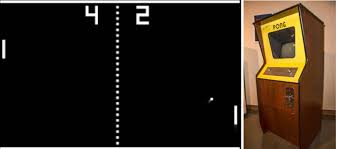
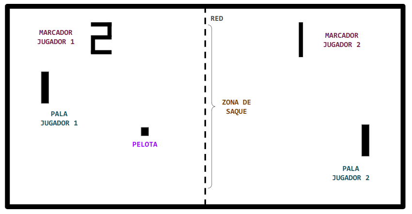

#### C.E. DVRV

### Programación y Motores de Videojuegos

#### Project: PONG

`[Unity ver.: 6.0.23f1]`

## Diseño

### Concepto

- **Título:** PONG

- **Plataforma:** PC

- **Género:** Arcade, Deportes, Simulación

- **Cámara:** Juego 2D con vista cenital

- **Descripción:**

  - Port para PC del juego PONG, Atari (1972).

  - Juego para dos jugadores que simula una partida de Ping Pong.

  - Ganará el partido el jugador que más puntos consiga.

### Elementos de diseño

### Mecánicas

- Cada jugador maneja su pala verticalmente.

- La pelota está en continuo movimiento, rebotando sobre las palas y sobre los laterales superior e inferior que delimitan la zona de juego.

- Si la pelota alcanza la pared lateral del campo de un jugador, supondrá un punto para el jugador contrario.

- Tanto al inicio del juego como cada vez que se consigue un punto, la pelota se relanzará desde el centro del campo, desde una posición vertical y con un ángulo aleatorios, en dirección al perdedor del punto.

- El sentido del primer saque será aleatorio.

- El juego mostrará las puntuaciones actuales de los jugadores.

- El juego termina cuando uno de los jugadores alcance 10 puntos.

- El jugador que alcance 10 puntos será el ganador de la partida.

- Se establecerá un mecanismo para el reinicio de la partida.

- Se reproducirán sonidos en los rebotes y al conseguir puntos.

### Mecánicas adicionales (práctica)

- Aumentar la velocidad de la pelota a medida que rebota.

- Añadir en el medio de la escena objetos circulares estáticos.

- Añadir en el medio de la escena objetos circulares con desplazamiento vertical.

- Añadir dos palas más para hacer un juego de cuatro jugadores.
